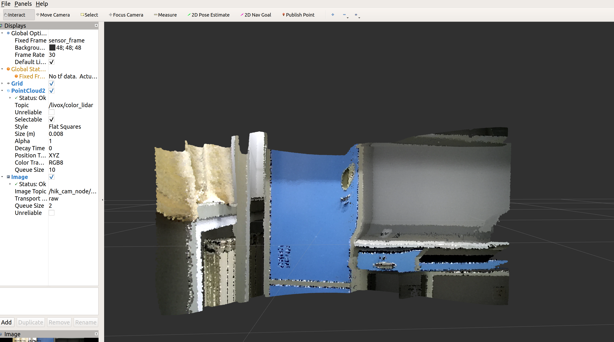

# fusion-lidar-camera-ROS
## 一、介绍
本仓库是一个ROS工作空间，其中ws_fusion_camera/src下是两个工具包color_pc和launch_file
```
ws_fusion_camera
│   README.md
│   
└───src
     │
     └───package: color_pc
     │                         node: color_pc   (fusion get colored point cloud)
     │                         node: intetral   (intetral colored point cloud)
     │                         node: topic_test (subscribe and test topic)
     └───package: launch_file
                               launch file: fusion.launch(color_pc)
                               launch file: integral.launch(integral)
                               launch file: test_topic.launch(topic_test)


```

调试环境：
* Ubuntu 18.04 ROS melodic
* PCL 1.8
* 硬件: livox Horizon激光雷达 && Hikvision 网络相机DS-2ZMN2007(C)

**注意:由于Hikvision网络相机不支持SDK软触发，因此两个设备无法做时间同步，硬件配置适用于对时间同步性要求较低的任务**

## 二、使用方法
1. 安装ROS
2. 安装livox和hikvision驱动<sup>[1, 2, 3]</sup>
3. 安装本仓库
```
mkdir -p ~/xxx/src
cd ~/xxx/src
catkin_init_workspace
git clone https://github.com/GCaptainNemo/fusion-lidar-camera-ROS.git
mv ./fusion-lidar-camera-ROS/ws_fusion_camera/src/color_pc  ./
mv ./fusion-lidar-camera-ROS/ws_fusion_camera/src/launch_file  ./
cd ..
catkin_make

```
4. 运行相机和激光雷达设备驱动
```
roslaunch livox_ros_driver livox_lidar.launch
roslaunch hikvision_ros hik.launch ip_addr:=192.168.1.64 password:=xxx

```

或者下载ROS-bag测试数据
地址: https://pan.baidu.com/s/1w7bDKjnXJyfzvX33t-spTA
提取码: n8px

5. 运行color_pc数据融合节点，并在rviz中显示
```roslaunch launch_file fusion.launch``` 

## 三、效果

<p align="center"></p>
<h6 align="center"> 融合效果</h6>

<p align="center"></p>
<h6 align="center"> 点云时间积分效果</h6>

## 四、参考资料

[1] [hikvision相机装ROS驱动](https://blog.csdn.net/qq_37534947/article/details/116432115)

[2] [livox 驱动安装](https://github.com/Livox-SDK/livox_ros_driver)

[3] [livox SDK安装](https://github.com/Livox-SDK/Livox-SDK)


