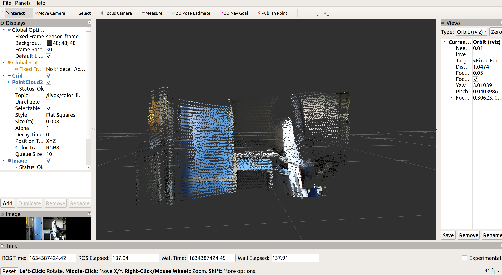

# fusion-lidar-camera-ROS
## 一、介绍
本仓库是一个ROS工作空间，其中ws_fusion_camera/src下是两个工具包color_pc和launch_file
```
ws_fusion_camera
│   README.md
│   
└───src
     │
     └───package: color_pc
       |                        node: color_pc   (fusion get colored point cloud)
     │                       node: topic_test (subscribe and test topic)
     └───package: launch_file
                                launch node file: fusion.launch(color_pc),  test_topic.launch(topic_test)

```

## 二、使用方法
1. 安装ROS
2. 安装livox和hikvision驱动<sup>[1, 2]</sup>
3. 安装仓库
```
mkdir -p ~/xxx/src
catkin_init_workspace
git clone https://github.com/GCaptainNemo/fusion-lidar-camera-ROS.git
mv ./fusion-lidar-camera-ROS/ws_fusion_camera/src/color_pc  ./
mv ./fusion-lidar-camera-ROS/ws_fusion_camera/src/launch_file  ./
cd ..
catkin_make

```
4. 运行相机和激光雷达设备驱动
```
roslaunch livox_ros_driver livox_lidar_rviz.launch bd_list:="xxx"
roslaunch hikvision_ros hik.launch ip_addr:=192.168.1.64 password:=xxx

```
5. 运行color_pc数据融合节点，并在rviz中显示
```roslaunch launch_file fusion.launch``` 

## 三、效果
<p align="center"></p>
<h6 align="center"> 融合效果</h6>
## 四、参考资料
[1] [hikvision相机装ROS驱动](https://blog.csdn.net/qq_37534947/article/details/116432115)
[2] [livox 驱动和SDK安装](https://github.com/Livox-SDK/Livox-SDK)


