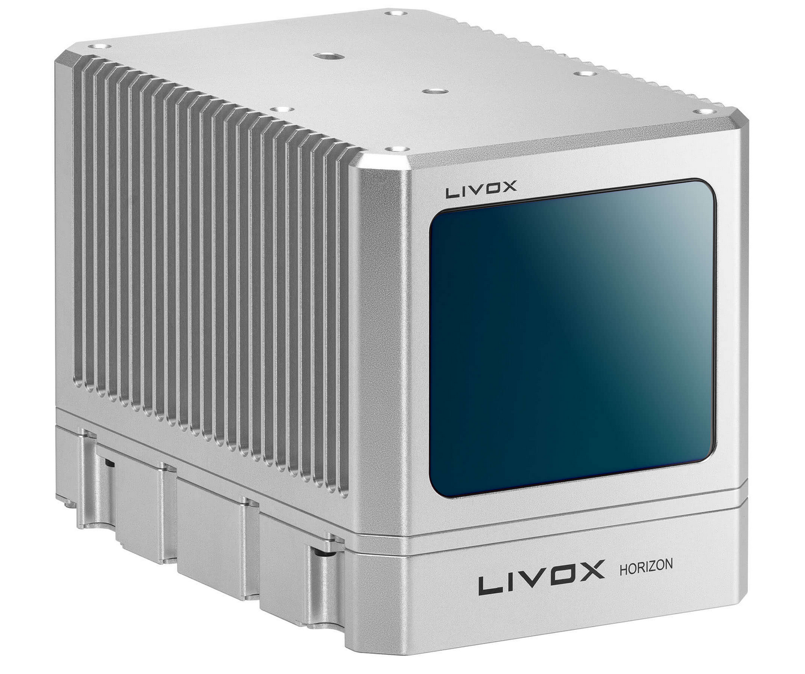
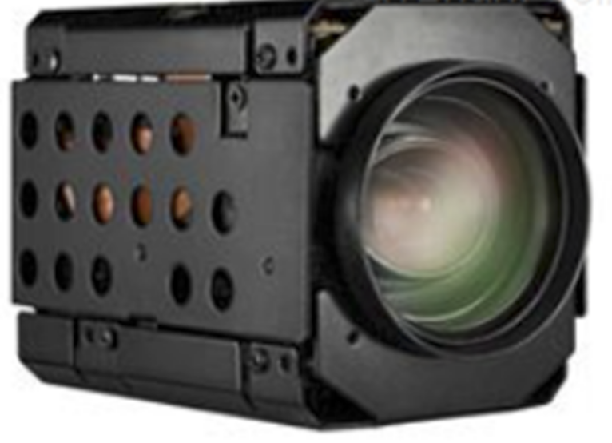

# fusion-lidar-camera-ROS
## 一、介绍
本仓库是一个ROS工作空间，其中ws_fusion_camera/src有一个工具包color_pc
```
ws_fusion_camera
│   README.md
│   
└───src
     │
     └───package: color_pc
                     │    node: color_pc_node   (fusion get colored point cloud)
                     │    node: intetral_node   (intetral colored point cloud)
                     │    node: color_pc_sync_node (use ROS message_filters::Synchronizer)
                     │
                     └───launch
                               launch file: fusion.launch(color_pc & rviz)
                               launch file: integral.launch(integral & rviz)
                               launch file: sync_fusion.launch(color_pc_sync & rviz)
		               	


```

调试环境：
* Ubuntu 18.04 ROS melodic. [ROS installation](http://wiki.ros.org/ROS/Installation)

* PCL 1.8. [PCL installation](https://pointclouds.org/downloads/#linux)

* OpenCV 3.2.0 [Opencv Installation](http://opencv.org)

* 硬件: livox Horizon激光雷达 && Hikvision 网络相机DS-2ZMN2007(C)

  <table >
      	<tr>
              	<th align="center" valign="middle">Item</th>
              	<th align="center" valign="middle">Pics</th>
              	<th align="center" valign="middle">Shopping Link</th>
          </tr>
      	<tr>
      	    	<td align="center" valign="middle">Livox Horizon</td>
          		<td align="center" valign="middle"></td>
          		<td align="center" valign="middle">  <a href ="https://www.livoxtech.com/horizon"> Lidar </a> 		    		</td>
      	</tr>
      	<tr>
            	 	 <td align="center" valign="middle">Hikvision DS-2ZMN2007(C)</td>
      	    	<td align="center" valign="middle"></td>
              	<td align="center" valign="middle">  
                      <a 	href="http://steven1210.51sole.com/companynewsdetail_129276267.htm"> Camera </a> 		    		</td>
      	</tr>
  </table>

**注意:由于Hikvision网络相机不支持SDK软触发，因此两个设备无法做时间同步，硬件配置适用于对时间同步性要求较低的任务**

## 二、使用方法
1. 安装ROS
2. 安装livox和hikvision ROS驱动<sup>[1, 2, 3]</sup>
3. 安装本仓库
```
mkdir -p ~/xxx/src
cd ~/xxx/src
catkin_init_workspace
git clone https://github.com/GCaptainNemo/fusion-lidar-camera-ROS.git
mv ./fusion-lidar-camera-ROS/ws_fusion_camera/src/color_pc  ./
mv ./fusion-lidar-camera-ROS/ws_fusion_camera/src/launch_file  ./
cd ..
catkin_make

```
4. 运行相机和激光雷达设备驱动
```
roslaunch livox_ros_driver livox_lidar.launch
roslaunch hikvision_ros hik.launch ip_addr:=192.168.1.64 password:=xxx

```

或者下载ROS-bag测试数据
地址: https://pan.baidu.com/s/1w7bDKjnXJyfzvX33t-spTA
提取码: n8px

5. 运行color_pc数据融合节点，并在rviz中显示
```
roslaunch color_pc fusion.launch
```

## 三、效果


<h6 align="center">单帧融合效果(左)，点云时间积分效果(右)</h6>


## 四、参考资料

[1] [hikvision相机装ROS驱动](https://blog.csdn.net/qq_37534947/article/details/116432115)

[2] [livox 驱动安装](https://github.com/Livox-SDK/livox_ros_driver)

[3] [livox SDK安装](https://github.com/Livox-SDK/Livox-SDK)


